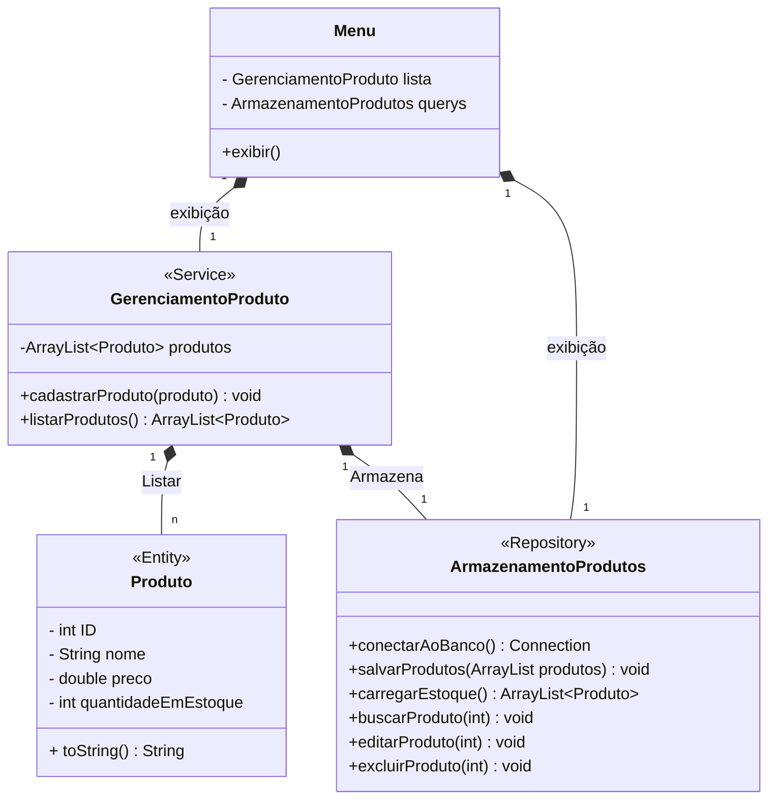

# Controle de inventário

## 📋 Apresentação
O projeto "Cadastro_Produto" tem como objetivo desenvolver, utilizando a linguagem Java focada em Orientação em Objetos, um aplicação que se aplique no mundo real 
por permitir lojas administrarem seus estoques. A aplicação entra em contato com um banco de dados e permite o usuário realizar todas as interações do CRUD, isto é,
criar produtos, ler as informações, editar informações e excluir.

## ⚙️ Diagrama de classes
Entenda como foi feita a organização do projeto e como se dá a relação dos objetos 



**Produto -** uma classe Model que representa um produto do mundo real e armazena as suas características

**GerenciamentoProduto -** a classe Service que possue uma lista os produtos cadastrados, para depois serem enviados ao banco de dados

**ArmazenamentoProdutos -** essa classe armazena os produtos no banco e carrega as funções com as querys que permitem as interações CRUD com o banco ocorrerem

**Menu -** a classe Model da interface feita para o usuário se comunicar com a aplicação e realizar as alterações no banco

## 🛠️ Estrutura
Conheça a estrutura do projeto

```
📦Cadastro_Produto
├─📂 src
│ └─📂 main
│   └─📂 java
│      └─📂 com
│         └─📂 exemplo
│            ├─📄 Main.java
│            ├─📂 Model
│            │  ├─📄 Menu.java
│            │  └─📄 Produto.java
│            ├─📂 Querys
│            │  └─📄 ArmazenamentoProdutos.java
│            └─📂 Service
│               └─📄 GerenciamentoProdutos.java
├─📄 pom.xml
└─📄 dados_banco.json
```

##  🔴 Pré-requisitos 
Itens que você precisa antes de rodar o código:

* MVN instalado na máquina
 
  No terminal, confira se já está instalado:
   ```
   mvn -version
   ```
  Caso não esteja, faça o download [aqui](https://maven.apache.org/download.cgi)

* Banco de dados criado
  
  É necessário já ter um banco de dados criado, para isso, abra o mysql no terminal:
  ```
  mvysql -u [usuário] -p 
  ```
  Crie o seu database
  ```
  CREATE DATABASE Cadastro_Produto;
  ```
  Acesse o databse e crie sua tabela
  ```
  USE Cadastro_Produto;
  CREATE TABLE produto( id INT AUTO_INCREMENT PRIMARY KEY,
                        nome VARCHAR(100) NOT NULL,
                        preco double NOT NULL,
                        quantidadeEstoque INT);
  ```
* Popular Banco [opcional]
  
  Caso deseje popular o banco de dados, baixe a biblioteca python:

  ```
  pip install mysql-connector-python
  ```

## 🟡 Autorização do banco de dados
Para se conectar é necessário passar informações pessoais para a API de conexão. Por isso, cada usuário deve criar um arquivo "dados_banco.json" no dirétorio raiz do projeto como o exemplo seguite, mas mudando as informações exigidas.

```
{
	"url": "jdbc:mysql://localhost/Cadastro_Produto?serverTimezone=UTC&threadCleanup=false",
	"user": [usuario],
	"password": [senha]
}
```
## 🟢 Inicialização
Como iniciar a aplicação 

1. No terminal, acesse o dirétorio raiz do projeto
2. Caso tenha escolhido popular o banco, rode o código python 
3. Compile os códigos
   ```
    mvn compile
   ```
4. Inicie o arquivo da Main
   ```
   mvn exec:java -Dexec.mainClass="com.exemplo.Main"
   ```
   
## 👨‍💻 Desenvolvedor
Responsável pela criação do projeto

Diego - Programação e documentação <br>
Email: diego.dpab@gmail.com <br>
Conheça mais acessando o GitHub do desenvolvedor [aqui](https://github.com/Di3go07)!
